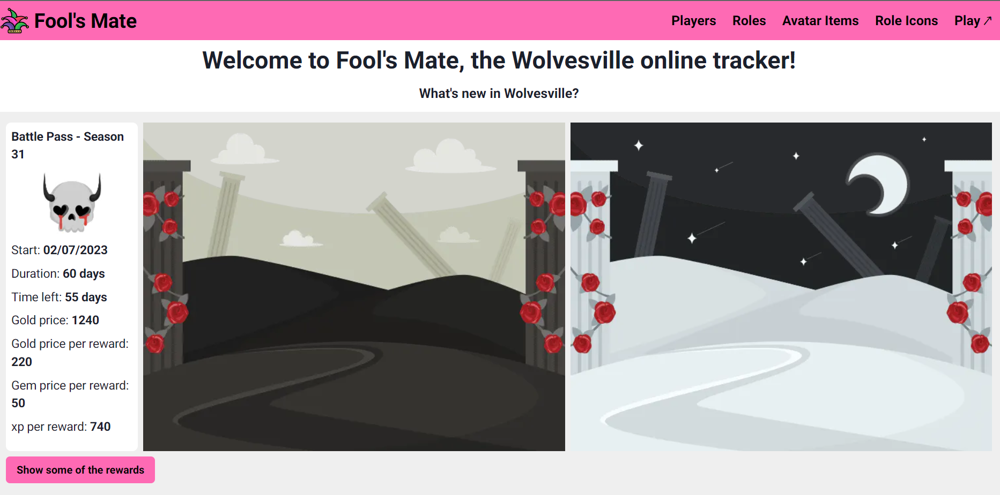

# :wolf: Fool's Mate: Wosvesville Online Tracker

| :placard: Vitrine.Dev |     |
| -------------  | --- |
| :sparkles: Nome        | **Fool's Mate**
| :label: Tecnologias | next, react, typescript, recharts, react-query, axios
| :rocket: URL         | https://foolsmate.vercel.app/

## :dart: Motivation

- Personal: Wolvesville means a lot for me as a game. As a player from beta, I saw it growing and evolving, even thought I was not always active. When they released a public API, I couldn't waste the opportunity to build something for a game and a community I love.

- Professional: I always wanted to build a project in "wiki" format, with which people could easily find useful info for something they like or need. I could apply recently acquired knowledge in both front and [back-end](https://github.com/Fearinn/foolsMateAPI).

## :video_game: Currently available

- Battle Pass season and its rewards;
- Players' profiles and stats;
- Avatar items, role icons and roles with filters and pagination;
- Sharable favorite avatar items and role icons.

## :hammer: Planned improvements

- Clans page;
- Players comparison;
- Dark theme;
- Live info, such as quests and offers.

## :handshake: How to help?

Feel free to open an issue in GitHub or to reach me directly with any suggestion or feedback. Sharing the deploy is also welcome.
